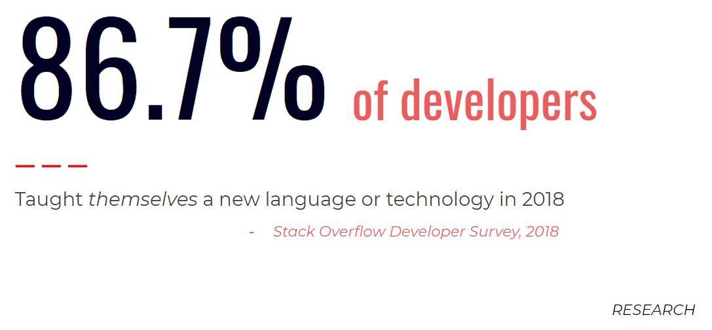
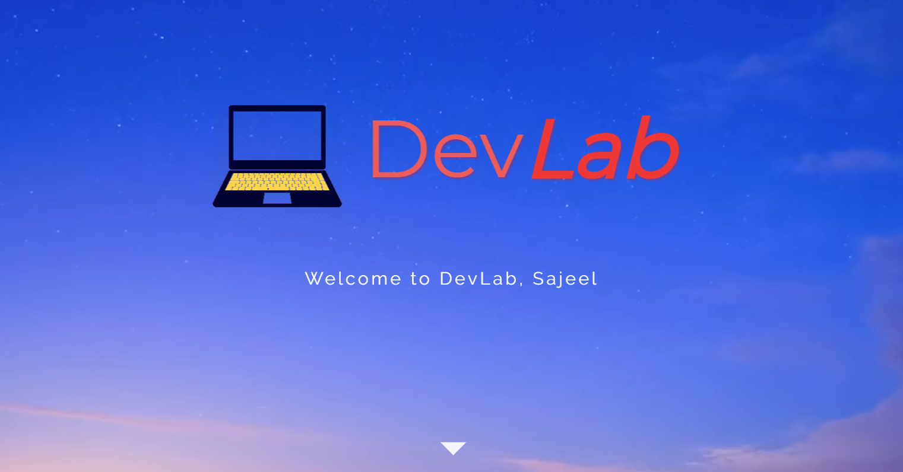
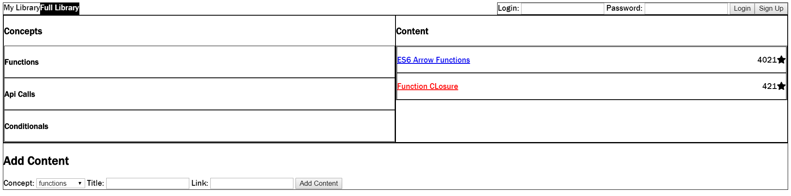
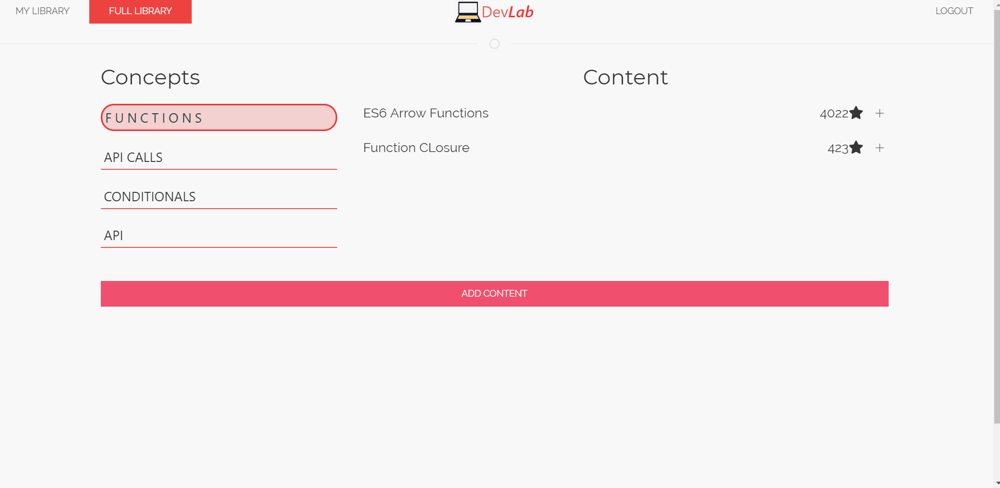

# [](devlab.herokuapp.com)


DevLab is a crowd-sourced platform for learning how to code. As developers, we are often bombarded with an overwhelming flood of resources. DevLab seeks to wade through the flood by providing a robust, user-driven tool to pool the best resources!

* This is a Full-Stack Application powered by Javascript, jQuery, SQL, and node.js. It follows a MVC framework with a RESTful architecture 

# Applied Research and Motivations



Developers and engineers are constantly seeking and self-learning new technologies. DevLab seeks to provide them the best peer-reviewed content by enabling them to upload, rate, and save the most helpful and effective material.


## Getting Started

Follow the deployed project link below to utilize the application.

### Deployed Project Link
<!-- make a link to the deployed site -->
 
[Dev Lab](devlab.herokuapp.com)


### Image Preview of DevLab
<!-- take a picture of the image and add it into the readme  -->
[](devlab.herokuapp.com)

## Prerequisites

The page can be run from any browser, preferably on Google Chrome!

## Technologies Used

### Frontend Technologies
* **HTML5**
* **CSS3** - Grid and FlexBox
* **Javascript** - the primary scripting logic enabling our application
* **jQuery** - the robust scripting library for Javascript
* [**UIkit**](https://getuikit.com/) - the open-source web styling framework used for structural design, animation, and filter-sorting
* [**Bideo.js**](https://github.com/rishabhp/bideo.js?utm_source=hashnode.com) - responsive video implementation
* [**Moment.js**](momentjs.com) - datetime manipulation
* Paint 3D - icon and image editing

### Backend Technologies and Critical Node Packages

#### Node.js - versatile Javascript runtime 
* **Express.js** - backend server routing framework
* **MySQL2** - server-side relational database usage
* **Sequelize.js** - object-relational mapping (ORM) for SQL
* **Passport.js** - local-strategy login authentication
* **Bcrypt** - two-sided hash encrypting
* **Body Parser, Path** - middleware technology for JSON and expediting filepaths

# Design History 

### Initial Mockups and Wireframe

We initially designed a rough wireframe outlining the core functionality of the application. The user would be able to log-in and parse through a variety of useful material and save the most relevant.


*Design Stage One*

### Final Design Comparisons

The application shifted through a rigorous design shift in which a splash page was rendered to comfortably welcome the user to the website.


*Splash Page - Design Stage Two and Three*

The main content section additionally went through a design overhaul, and a cleaner, dynamic concept page was created.


*Main Content - Design Stage Two and Three*

# Code Snippets
<!-- put snippets of code inside ``` ``` so it will look like code -->
<!-- if you want to put blockquotes use a > -->

Sorting through user-saved results was a relatively challenging feature to introduce to the application. Initially, we deeply considered an entirely back-end approach where we would run unique SQL queries to order the list items by specific parameters, but that would require a new query each time we required a sorting - breaking the RESTful paradigm to which we were ascribing. Instead, we adopted UIKit's unique filter method and applied a *uk-filter* to the User Library to target 


Here is a brief demonstration of the filter-sorting in action:




```


```


# Learning Points and Future Goals
<!-- Learning points where you would write what you thought was helpful -->
* 

## Core Developers

* **Andrew Meyer** - [GitHub](https://github.com/andypants152)
* **Brian Qian** - [GitHub](https://github.com/brianq0)
* **Sajeel Malik** - [GitHub](https://github.com/sajeelmalik)
* **Shuhan Laura Lee** - [GitHub](https://github.com/lalatw)

### Task Breakdown

| Task                                                                     | Lead                        |
|--------------------------------------------------------------------------|-----------------------------|
| Design, Research, Logic and Execution                                    | Andrew, Brian, Sajeel, Laura |
| *SQL and Sequelize*  Team                                                 | Laura, Brian                |
| *Authentication* and Passport Execution                                         | Andrew                      |
| *Graphics/Front End* Direction                                             | Sajeel                       |
| *Client-side* Javascript and jQuery                                         | Brian, Sajeel                      |
| *Routing and Model* Construction                                             | Laura, Andrew, Brian                |

## License

This project is licensed under the MIT License - see the [LICENSE.md](LICENSE.md) file for details